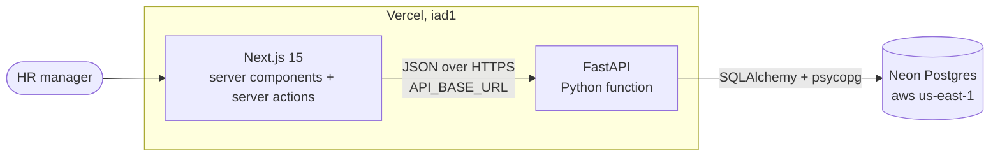
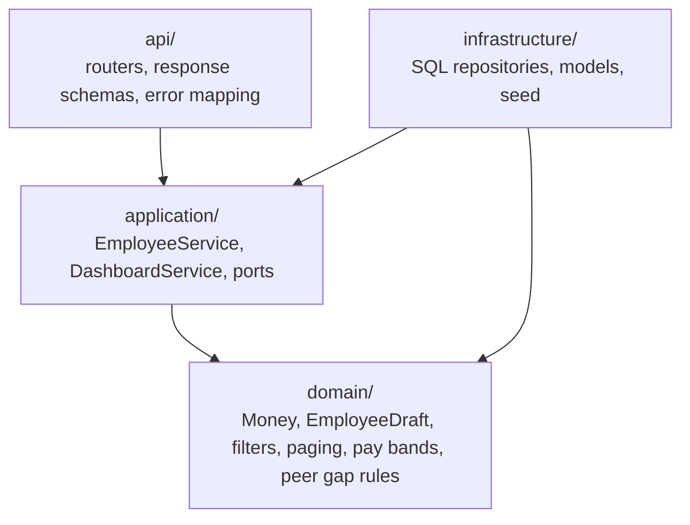
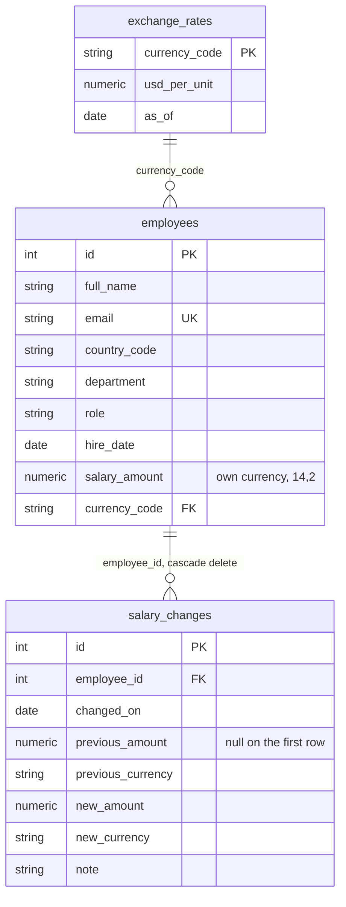
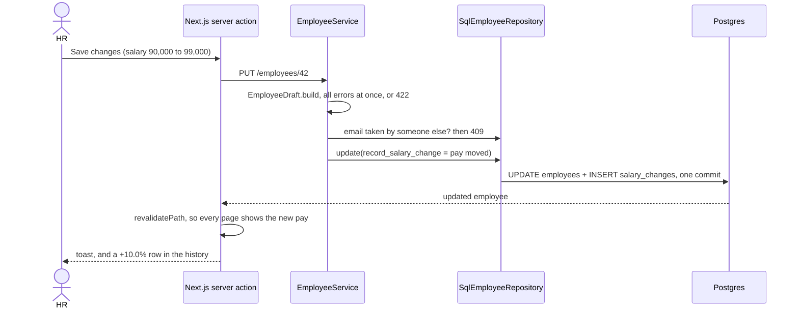

# Architecture

How the pieces fit, the calls I made and what they cost, and what I measured.

## The system

- The browser only talks to Next.js. Pages render on the server and writes go through server
  actions, so the browser never calls the API directly and the API URL never ships to the client.
- Locally the same three pieces run with `docker compose up`, plus a one-shot seed container.
- Tests swap Postgres for SQLite in memory. That is why the suite runs in about a second, and why
  no query uses Postgres-only SQL.

## Inside the API

Four layers. Imports only point inwards.

- `domain/` is plain Python, no FastAPI or SQLAlchemy. It holds the rules worth being sure about
  on their own: money rounds half up to the cent, a form returns every error at once, a hire date
  cannot be in the future, only whitelisted columns sort, and pay bands cover the top earner.
- `application/` depends on `ports.py`, which is a set of `Protocol` classes. The services never
  see a database session, so their tests run against small fakes.
- `infrastructure/` is the only code that knows SQL exists, and holds all the performance work.
- `api/` parses the request, calls a service, and shapes the response. Domain errors map to
  400, 404, 409 and 422 in one place in `main.py`.

## Data model

Current pay lives on `employees`, and `salary_changes` is an append-only log beside it. Reading
current pay never touches the history, so the list and dashboard queries stay as fast as they
were before history existed.

## Changing someone's pay

The service decides whether pay moved, by comparing amount and currency. Fixing a typo in a name
writes no history row. The currency always comes from the country, so HR cannot pay someone in
India in dollars by mistake.

## Decisions and what they cost

| Decision | Why | Cost |
| --- | --- | --- |
| USD conversion is `salary_amount * usd_per_unit`, joined in SQL | Sorting by USD pay, filters and every total stay in the database. Converting in Python would mean loading every row. | Every analytic query joins the rates table. Cheap here: 8 rows, primary key. |
| No stored `salary_usd` column | A stored value is wrong the moment a rate changes. | Sorting by USD pay cannot use an index. 4.7 ms at 10,000 rows. |
| Median via `ROW_NUMBER` and `COUNT` windows, not `percentile_cont` | Same SQL on Postgres and SQLite, so tests stay fast. Checked against `percentile_cont` on both databases: 43,824.61 either way. | Slightly longer SQL than the built-in. |
| SQLite for tests | 199 tests in about a second, no containers. | SQLite has no real decimal type, so a test pins the half-cent rounding case. |
| Offset paging, with `id` as the last sort key | Page numbers in the URL are easy to share. `id` last means no row shows up twice across pages. | Deep pages scan and throw rows away. The fix is keyset paging on `(sort_key, id)`, and the tie-breaker is already there for it. |
| Money as `NUMERIC(14,2)` and `Decimal`, sent as strings | A 578 million dollar payroll does not survive a JSON float. | The web app formats strings, not numbers. |
| Peer median uses everyone in the role and country, whatever the filter | Filtering to one department changes who is listed, not what normal pay is. | One extra window query over the whole table per request. |
| Server components with filters in the URL | Every filtered view is a link you can bookmark, and back works. Little client JS. | Each filter change is a server round trip. |
| `create_all` behind a CLI command, not Alembic | The database is always built from empty here. | Alembic is day-one work for real use. |

## Performance

Measured on the full 10,000-person seed. Each number is planning plus execution time from
`EXPLAIN ANALYZE`, for every query the call runs, median of 5 runs. Network time is not included.

| Call | Queries | Local Postgres 16 | Neon free tier |
| --- | --- | --- | --- |
| Employees page 1, sorted by USD pay | 2 | 4.7 ms | 8.3 ms |
| Employees, India + Engineering, page 20 | 2 | 1.0 ms | 1.9 ms |
| Employees, search "sharma" | 2 | 7.0 ms | 7.8 ms |
| One employee with pay history | 2 | 0.1 ms | 0.4 ms |
| Dashboard, grouped by country | 5 | 27.7 ms | 61.3 ms |
| Dashboard, US only, grouped by role | 5 | 8.6 ms | 18.4 ms |
| Pay review list, top 100 | 2 | 36.2 ms | 66.5 ms |

What keeps those numbers low:
- Paging is `LIMIT` and `OFFSET` in SQL, with a separate `COUNT(*)` that skips the rates join,
  because no filter needs it.
- A composite index on `(country_code, department, role)`, the exact filters the UI sends.
- Sort columns come from an enum mapped to SQL. User text never reaches `ORDER BY`.
- Average pay is total divided by headcount, so the cards can never disagree by a cent.

What would break first at 10 million rows, in order:
1. **Medians.** An exact median sorts the whole filtered set, and the dashboard and pay review
   list do it on every request. At scale that needs a nightly rollup table or an approximate
   median, which trades exactness for speed. That is a product call, so I wrote it down instead
   of guessing.
2. **Search.** `LIKE '%term%'` cannot use a normal index. Postgres has trigram indexes for this,
   but they are Postgres-only, so they are not in a schema that also builds on SQLite.
3. **Deep pages.** Offset scans get slower with page number. Keyset paging fixes it.
4. **Filter dropdowns.** Three `SELECT DISTINCT` queries per page render. Cache them and clear
   the cache on write.

What the live site adds on top: from Kathmandu the API answers in about 0.5 s, and most of that
is the round trip to the US. The free tiers sleep when idle, so the first request after a quiet
spell can take a few seconds while the Python function and the Neon database wake up.

## Known gaps

- The dashboard runs its queries one after another, not in one snapshot. A save that lands
  between them could make the cards and the chart differ by one person for that one page load.
- Two people editing the same employee at once: the last save wins. A version column checked
  on update would fix it.
- No login. It is the first thing to add, through the company's SSO.
